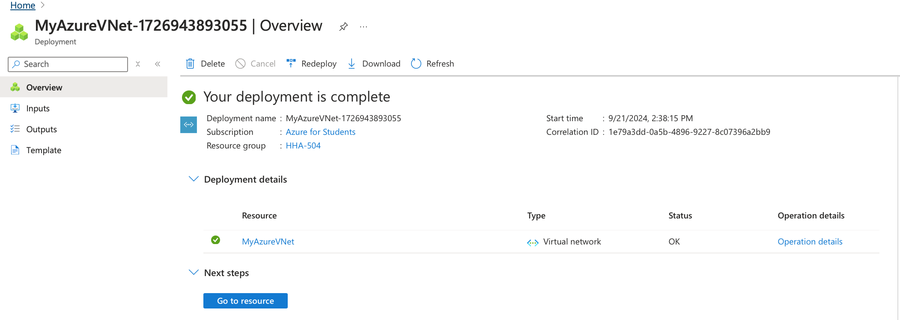
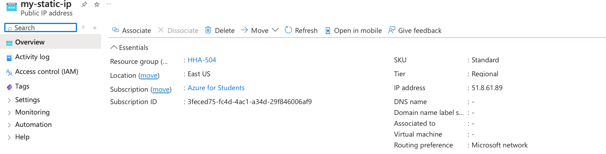
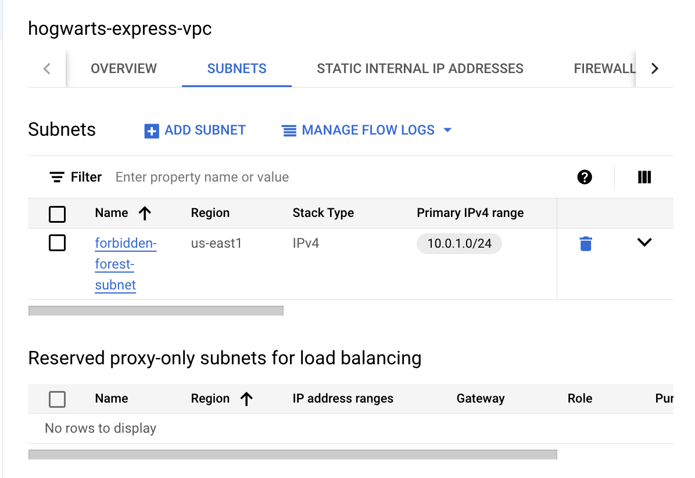
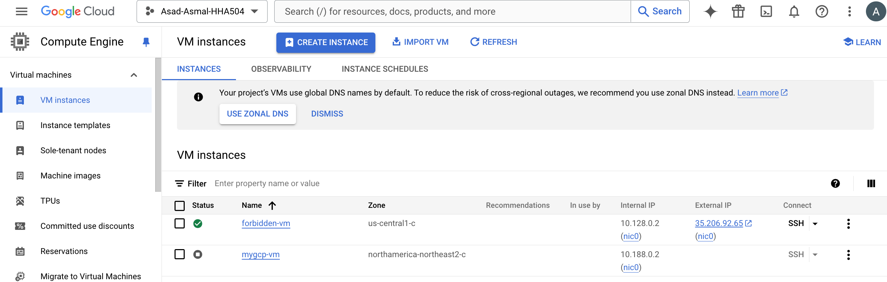
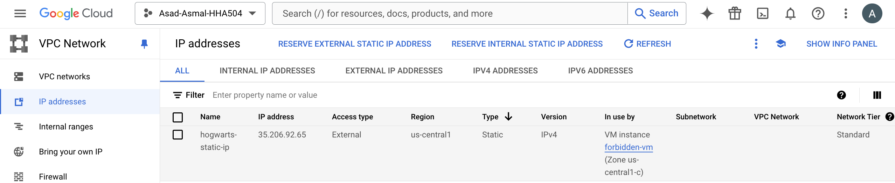

# Azure Networking Assignment - VNet and Public IP Creation

## Step 1: Creating the Virtual Network (VNet)

The first step in setting up networking in Azure was to create a Virtual Network (VNet). This provides a private network in the cloud where resources like virtual machines can communicate with each other securely.

- **Resource Group**: HHA-504
- **VNet Name**: `MyAzureVNet`
- **Region**: East US
- **Address Space**: `10.0.0.0/16`
- **Subnet**: `default (10.0.0.0/24)`

This configuration reserves a range of IP addresses (`10.0.0.0/16`) and sets up a subnet for internal network resources.

### Screenshot: Virtual Network Creation

---

## Step 2: Reserving a Static Public IP Address

Next, I reserved a **Static Public IP**. A static IP ensures that the address doesn’t change, which is important for public-facing resources like web servers.

- **Public IP Name**: `my-static-ip`
- **Region**: East US
- **IP Version**: IPv4
- **Assignment**: Static
- **SKU**: Standard

The **Static IP** ensures that the IP address won’t change, and the **Standard SKU** ensures better reliability and performance.

### Screenshot: Public IP Creation

---

## Step 3: Attempting to Create a Virtual Machine (VM)

The goal was to assign the static IP to a Virtual Machine (VM) so it could be accessed from the internet. However, I faced some challenges here.

### VM Configuration:
- **Operating System**: Ubuntu Server 24.04 LTS
- **Authentication**: SSH Public Key
- **VM Size**: Tried to select low-cost options like **B1ls** or **B1ms**
- **Inbound Ports**: Allowed SSH (port 22)

### Challenge: VM Size Unavailability

Unfortunately, many of the low-cost VM sizes were **unavailable**. I attempted to switch regions and request a quota increase, but these options weren’t possible.

---

## Step 4: Conclusion and Recommendations

Although I successfully created the Virtual Network and reserved a Static Public IP, I was unable to assign the IP to a VM due to issues with VM size availability.

---

# GCP Networking Assignment - VPC and Static IP Creation

## Step 1: Creating the Virtual Private Cloud (VPC)

The first step in setting up networking in GCP was to create a Virtual Private Cloud (VPC). This provided an isolated network environment for managing resources like virtual machines and subnets.

- **VPC Name**: `hogwarts-express-vpc`
- **Subnet Creation Mode**: Custom
- **MTU**: 1460
- **IP Address Range (Primary Subnet)**: `10.0.1.0/24`

This configuration defines the network space and the primary subnet, ensuring secure communication between resources.

### Screenshot: VPC Creation

---

## Step 2: Configuring the Subnet

Next, I configured a custom subnet for the VPC, which will allocate specific IP addresses for internal network resources like virtual machines.

- **Subnet Name**: `forbidden-forest-subnet`
- **Region**: `us-east1`
- **Primary IPv4 Range**: `10.0.1.0/24`

This subnet provides IP addresses within the `10.0.1.0/24` range and allows GCP resources in `us-east1` to communicate securely.

---

## Step 3: Reserving a Static Public IP Address

I then reserved a **Static Public IP Address** for the VM to ensure a consistent IP for external access.

- **Public IP Name**: `hogwarts-static-ip`
- **Region**: `us-central1`
- **IP Version**: IPv4
- **Type**: Static
- **Network Service Tier**: Standard

This static IP ensures that the address remains unchanged and is linked to the VM for external accessibility.

---

## Step 4: Creating the Virtual Machine (VM)

After reserving the static IP, I created a VM in GCP and attached the static IP to the VM for public access.

### VM Configuration:
- **VM Name**: `forbidden-vm`
- **Zone**: `us-central1-c`
- **Machine Type**: e2-micro (to minimize costs)
- **Operating System**: Debian GNU/Linux 12 (Bookworm)
- **Disk Size**: 10 GB balanced persistent disk
- **Network Interface**: `forbidden-forest-subnet`

I attached the VM to the `forbidden-forest-subnet` to ensure that it operates within the designated VPC and subnet.

### Screenshot: VM Creation

---

## Step 5: Verifying the Static IP Attachment

Finally, I verified that the static IP `hogwarts-static-ip` was successfully attached to the VM `forbidden-vm`.

- **External IP**: `35.206.92.65`
- **Subnet**: `forbidden-forest-subnet`

### Screenshot: IP Verification

---

## Platform Comparison: GCP vs. Azure

As I worked through this assignment, I realized that both Google Cloud Platform (GCP) and Microsoft Azure have their own strengths.

### GCP:

Google Cloud Platform offers a lot of features and options, but I found the interface a bit tricky to navigate. For example, setting up a VPC, configuring subnets, reserving a static IP, and attaching it to a VM involved multiple steps across different parts of the dashboard. This might be confusing for new users, as it requires close attention to detail and a clear understanding of the available options. However, GCP does provide powerful tools for complex networking setups and flexibility when needed.

### Azure:

In comparison, Azure provides a more user-friendly experience. The step-by-step processes for setting up a VNet and creating public IP addresses were easy to follow, and the navigation was more straightforward. Azure’s platform offers more guidance throughout, but I did find it challenging to find low-cost VM sizes. Despite this, Azure seems to be more intuitive for smaller, simpler projects.

### Recommendation:

If you need flexibility and detailed control over your network, GCP offers greater customization. However, if you're looking for a platform that's easier to use and guides you through the process with a more straightforward interface, Azure might be the better choice.
